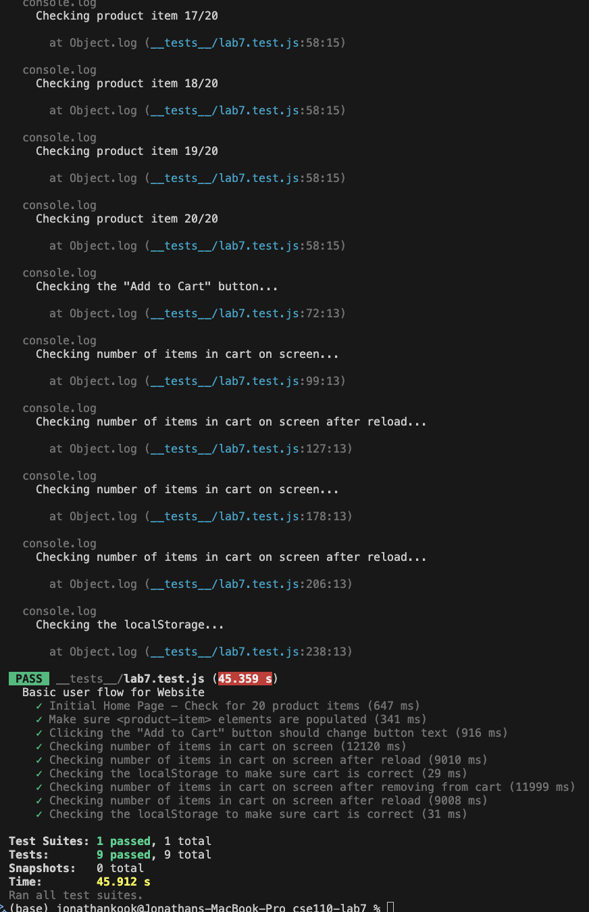

# CSE110 Lab 7 
`Jonathan Kook - A18093135`

1. Where would you fit your automated tests in your Recipe project development pipeline?  
`Within a Github action that runs whenever code is pushed.` 
 
Running automated tests on every push ensures that any code that is pushed to Github will be validated. This helps prevent broken code from being pushed or merged, as well as maintaining overall code quality. Manually running the tests before pushing code takes too much time and is unnecesary. Running the test after development would be inefficient, as it would make it much harder to catch errors/bugs since broken code can be pushed or merged.

2. Would you use an end to end test to check if a function is returning the correct output?  
`No, you wouldn't use an end to end test to check if a function is returning the correct output.`
 
To check if a functin is returning the correct output, you should use a unit test rather than an end ot end test. Unit tests are used to test individual functions or components in isolation. End to end tests are used to test the application as a whole to ensure that all of the functions and components work seamlessly. 

3. What is the difference between navigation and snapshot mode?  
`Navigation mode is best used for analyzing performance metrics, and is ideal for testing user flows such as logging in, submitting forms, navigating, etc. Snapshot mode is best used for analyzing a page in its current state (without navigating), making it useful for inspecting elements or verifying DOM structure.`

4. Name three things we could do to improve the CSE 110 shop site based on the Lighthouse results.  
`1. Chrome extensions negatively affected this page's load performance. Try auditing the page in incognito mode or from a Chrome profile without extensions.`  
`2. Clearing the browser cache timed out. Try auditing this page again and file a bug if the issue persists.`  
`3. <html> element does not have a [lang] attribute. No <meta name="viewport"> tag found.`

